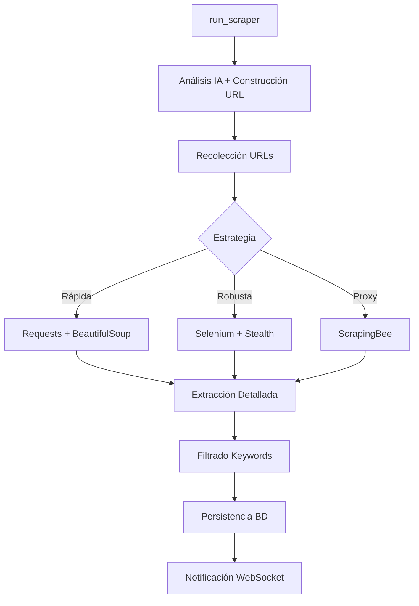
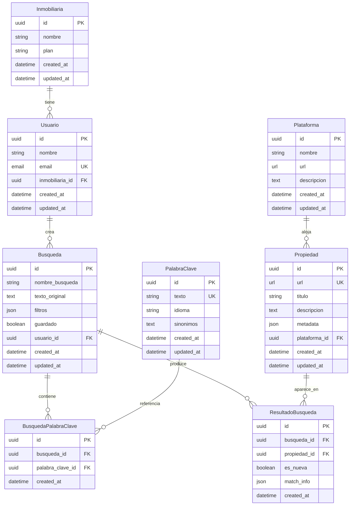

# 📚 Documentación Técnica - Buscador Inmobiliario

## 🎯 Arquitectura del Sistema

### 📋 Resumen Ejecutivo

El **Buscador Inmobiliario Inteligente** es una aplicación web Django moderna que ha evolucionado de un sistema basado en archivos JSON a una arquitectura de base de datos relacional robusta y escalable. La aplicación utiliza inteligencia artificial, scraping modular y comunicación en tiempo real para automatizar la búsqueda de propiedades inmobiliarias.

**Versión actual**: 2.0 (Base de datos relacional + Scraper modular)  
**Stack principal**: Django 5.1 + PostgreSQL/SQLite + Redis + WebSockets  
**Arquitectura**: Modular, microservicios-ready, cloud-native  

### 🏗️ **Principios de Diseño**
- **Modularidad**: Componentes independientes y reutilizables
- **Escalabilidad**: Diseño preparado para crecimiento horizontal
- **Observabilidad**: Logging, métricas y debugging comprehensive
- **Resilencia**: Manejo de errores robusto y fallbacks
- **Developer Experience**: APIs claras y documentación completa

---

## 🕸️ Arquitectura del Scraper Modular

### 📦 **Estructura del Paquete `core/scraper/`**

```
core/scraper/
├── __init__.py              # API pública y fachada del scraper
├── run.py                   # Orquestador principal del proceso
├── mercadolibre.py          # Lógica específica de MercadoLibre
├── browser.py               # Gestión de navegadores (Selenium + stealth)
├── extractors.py            # Extracción y parsing de datos
├── url_builder.py           # Construcción inteligente de URLs
├── utils.py                 # Utilidades (stemming, keywords, validación)
├── progress.py              # Sistema de progreso y notificaciones
└── constants.py             # Constantes y configuración
```

### 🔧 **Componentes Principales**

#### **1. API Pública (`__init__.py`)**
Fachada que expone funciones principales con imports perezosos:
```python
# Funciones principales
from .run import run_scraper
from .mercadolibre import scrape_mercadolibre, extraer_total_resultados_mercadolibre
from .url_builder import build_mercadolibre_url, normalizar_para_url
from .extractors import scrape_detalle_con_requests, recolectar_urls_de_pagina

# Gestión de navegador
from .browser import iniciar_driver, manejar_popups_cookies, verificar_necesita_login, cargar_cookies

# Utilidades
from .utils import stemming_basico, extraer_variantes_keywords
from .progress import send_progress_update, tomar_captura_debug
```

#### **2. Orquestador (`run.py`)**
Coordina todo el proceso de scraping en fases:
```python
def run_scraper(filtros, search_id=None, channel_layer=None, 
                user_channel=None, palabras_clave=None):
    """
    Ejecuta el scraping completo en fases:
    1. Análisis de filtros y construcción de URL
    2. Recolección de URLs de propiedades
    3. Extracción detallada de cada propiedad
    4. Filtrado por keywords
    5. Persistencia y notificación
    """
```

#### **3. Lógica MercadoLibre (`mercadolibre.py`)**
Implementa la lógica específica del portal:
```python
def scrape_mercadolibre(url, num_paginas=None, max_hilos=3):
    """Scraping específico de MercadoLibre con múltiples estrategias"""

def procesar_pagina_con_requests(url, max_reintentos=3):
    """Estrategia rápida con requests/BeautifulSoup"""

def procesar_pagina_con_selenium(url):
    """Estrategia robusta con Selenium para casos complejos"""
```

#### **4. Gestión de Navegador (`browser.py`)**
Encapsula la configuración y manejo de Selenium:
```python
def iniciar_driver(headless=True, stealth=True):
    """Inicializa Chrome con configuración optimizada"""

def manejar_popups_cookies(driver):
    """Maneja popups automáticamente"""

def verificar_necesita_login(driver, tomar_captura=True):
    """Detecta si se requiere login"""
```

#### **5. Extractores (`extractors.py`)**
Centraliza toda la lógica de extracción:
```python
def extraer_propiedades_de_pagina(soup):
    """Extrae lista de propiedades de una página de resultados"""

def extraer_detalle_propiedad(url, usar_selenium=False):
    """Extrae detalles completos de una propiedad individual"""

def extraer_precio_desde_elemento(elemento):
    """Normaliza precios de diferentes formatos"""
```

### 🔄 **Flujo de Ejecución**



### ⚡ **Estrategias de Scraping**

| Estrategia | Velocidad | Robustez | Uso de Recursos | Casos de Uso |
|-----------|-----------|----------|-----------------|--------------|
| **Requests + BS4** | ⚡⚡⚡ | ⭐⭐ | 🔋 | Recolección masiva |
| **Selenium** | ⚡ | ⭐⭐⭐ | 🔋🔋🔋 | Navegación compleja |
| **ScrapingBee** | ⚡⚡ | ⭐⭐⭐⭐ | 💰 | Anti-bot avanzado |

### 🛡️ **Características de Resilencia**

#### **Manejo de Errores Multicapa**
```python
# Nivel 1: Reintentos automáticos
@retry(max_attempts=3, backoff_factor=2)
def procesar_url(url):
    pass

# Nivel 2: Fallback de estrategias
def procesar_con_fallback(url):
    try:
        return procesar_con_requests(url)
    except Exception:
        return procesar_con_selenium(url)

# Nivel 3: Continuación con errores parciales
def procesar_lote_urls(urls):
    resultados = []
    for url in urls:
        try:
            resultado = procesar_url(url)
            resultados.append(resultado)
        except Exception as e:
            logger.warning(f"Error en {url}: {e}")
            continue  # Continúa con las siguientes
    return resultados
```

#### **Rate Limiting Inteligente**
```python
class RateLimiter:
    def __init__(self, requests_per_second=2):
        self.delay = 1.0 / requests_per_second
        self.last_request = 0
    
    def wait_if_needed(self):
        elapsed = time.time() - self.last_request
        if elapsed < self.delay:
            time.sleep(self.delay - elapsed)
        self.last_request = time.time()
```

---

## 🗃️ Arquitectura de Base de Datos

### 📊 **Diagrama de Entidades y Relaciones**



### 🏛️ **Modelos de Datos Detallados**

#### **1. Sistema de Búsquedas Unificado**

**Búsqueda** - Modelo central del sistema:
```python
class Busqueda(models.Model):
    id = models.UUIDField(primary_key=True, default=uuid.uuid4)
    nombre_busqueda = models.CharField(max_length=200)
    texto_original = models.TextField()
    filtros = models.JSONField(default=dict)  # Filtros estructurados
    guardado = models.BooleanField(default=False)  # Visibilidad en UI
    usuario = models.ForeignKey(Usuario, on_delete=models.CASCADE)
    
    class Meta:
        indexes = [
            models.Index(fields=['usuario', 'guardado', 'created_at']),
            models.Index(fields=['guardado', 'created_at']),
        ]
        ordering = ['-created_at']
```

**Diferenciación de Búsquedas**:
- `guardado=True`: Visible en interfaz ("Buscar y Guardar")
- `guardado=False`: Solo historial interno ("Buscar")
- **Beneficio**: Análisis completo sin cluttering de UI

#### **2. Sistema de Palabras Clave Inteligente**

```python
class PalabraClave(models.Model):
    texto = models.CharField(max_length=100, unique=True)
    idioma = models.CharField(max_length=10, default='es')
    sinonimos = models.TextField(blank=True, default='')  # JSON serializado
    
    @property
    def sinonimos_list(self):
        """Convierte JSON string a lista para compatibilidad SQLite"""
        try:
            return json.loads(self.sinonimos) if self.sinonimos else []
        except json.JSONDecodeError:
            return []
    
    def set_sinonimos(self, lista):
        """Convierte lista a JSON string"""
        self.sinonimos = json.dumps(lista, ensure_ascii=False)
        
    def add_sinonimo(self, palabra):
        """Añade sinónimo si no existe"""
        sinonimos = self.sinonimos_list
        if palabra.lower() not in [s.lower() for s in sinonimos]:
            sinonimos.append(palabra)
            self.set_sinonimos(sinonimos)
```

#### **3. Sistema de Propiedades y Resultados**

```python
class Propiedad(models.Model):
    url = models.URLField(unique=True)  # Clave de deduplicación
    titulo = models.CharField(max_length=500, blank=True, null=True)
    descripcion = models.TextField(blank=True, null=True)
    metadata = models.JSONField(default=dict, blank=True)
    plataforma = models.ForeignKey(Plataforma, on_delete=models.CASCADE)
    
    def get_precio(self):
        """Extrae precio normalizado del metadata"""
        return self.metadata.get('precio', {})
    
    def get_caracteristicas(self):
        """Extrae características normalizadas"""
        return self.metadata.get('caracteristicas', {})
    
    def get_imagen_principal(self):
        """URL de imagen principal"""
        return self.metadata.get('imagen_url', '')

class ResultadoBusqueda(models.Model):
    busqueda = models.ForeignKey(Busqueda, on_delete=models.CASCADE)
    propiedad = models.ForeignKey(Propiedad, on_delete=models.CASCADE)
    es_nueva = models.BooleanField(default=True)  # Nueva vs ya existente
    match_info = models.JSONField(default=dict)  # Info de coincidencias
    
    class Meta:
        unique_together = ['busqueda', 'propiedad']
        indexes = [
            models.Index(fields=['busqueda', 'es_nueva']),
            models.Index(fields=['created_at']),
        ]
```

### 🔍 **Sistema de Índices y Optimización**

```python
# Índices para consultas frecuentes
class Meta:
    indexes = [
        # Búsquedas por usuario
        models.Index(fields=['usuario', 'guardado', 'created_at']),
        
        # Resultados por búsqueda
        models.Index(fields=['busqueda', 'es_nueva', 'created_at']),
        
        # Propiedades por plataforma
        models.Index(fields=['plataforma', 'created_at']),
        
        # Palabras clave por idioma
        models.Index(fields=['idioma', 'texto']),
    ]
```

### 📊 **Ejemplo de Metadata JSON**

```json
// Propiedad.metadata
{
  "precio": {
    "valor": 175000,
    "moneda": "USD",
    "tipo": "venta"
  },
  "caracteristicas": {
    "dormitorios": 2,
    "baños": 1,
    "superficie_total": 65,
    "superficie_util": 58,
    "garage": true,
    "terraza": false,
    "piscina": false
  },
  "ubicacion": {
    "departamento": "Montevideo",
    "ciudad": "Montevideo", 
    "barrio": "Pocitos"
  },
  "imagen_url": "https://http2.mlstatic.com/...",
  "fuente": {
    "portal": "MercadoLibre",
    "fecha_scraping": "2025-09-15T10:30:00Z",
    "url_original": "https://..."
  }
}

// ResultadoBusqueda.match_info
{
  "keywords_matched": ["luminoso", "terraza"],
  "keywords_total": 3,
  "match_score": 0.85,
  "filtros_aplicados": {
    "precio_range": true,
    "tipo_propiedad": true,
    "ubicacion": true
  }
}
```

---

## 🔧 Sistema de Gestión (search_manager.py)

### 🎯 **Arquitectura del Gestor de Búsquedas**

El `search_manager.py` es el núcleo del sistema de gestión de búsquedas, actuando como una capa de abstracción entre las vistas/consumers y los modelos de base de datos. Proporciona APIs consistentes y manejo de lógica de negocio compleja.

### 📋 **Funciones Principales**

#### **🔍 Gestión de Búsquedas**

```python
def get_all_searches() -> List[Dict[str, Any]]:
    """
    Retorna solo búsquedas visibles en interfaz (guardado=True)
    Optimizada con select_related para evitar N+1 queries
    """

def get_all_search_history() -> List[Dict[str, Any]]:
    """
    Retorna TODAS las búsquedas para análisis interno
    Incluye tanto guardadas como temporales
    """

def get_search(search_id: str) -> Optional[Dict[str, Any]]:
    """
    Obtiene búsqueda específica con resultados relacionados
    Incluye prefetch de propiedades y palabras clave
    """

def save_search(search_data: Dict[str, Any]) -> str:
    """
    Crea nueva búsqueda con validación y relaciones
    Retorna UUID de la búsqueda creada
    """

def delete_search(search_id: str) -> bool:
    """
    Eliminación suave: remueve de lista del usuario
    Preserva datos para análisis y métricas
    """

def restore_search_from_history(search_id: str) -> bool:
    """
    Función administrativa: recupera búsqueda eliminada
    Marca guardado=True para que vuelva a ser visible
    """
```

#### **📊 Procesamiento de Palabras Clave**

```python
def procesar_keywords(texto_busqueda: str) -> List[Dict[str, Any]]:
    """
    Pipeline completo de procesamiento de keywords:
    1. Normalización de texto (acentos, minúsculas)
    2. Tokenización inteligente
    3. Stemming básico en español
    4. Generación de sinónimos
    5. Persistencia en BD con relaciones
    """

def get_or_create_palabra_clave(texto: str, idioma: str = 'es') -> PalabraClave:
    """
    Obtiene o crea palabra clave con sinónimos
    Implementa cache en memoria para performance
    """

def generar_sinonimos(palabra: str) -> List[str]:
    """
    Genera sinónimos automáticos:
    - Stemming básico (luminoso → lumin)
    - Variaciones comunes (garage → garaje)
    - Plurales y singulares
    """
```

#### **🎯 Sistema de Coincidencias**

```python
def buscar_coincidencias(busqueda_id: str, propiedades: List[Dict]) -> List[Dict]:
    """
    Algoritmo fuzzy matching para keywords:
    - Coincidencia del 70% mínima
    - Peso por importancia de keyword
    - Score agregado por propiedad
    """

def verificar_coincidencia(palabras_clave_rel, propiedad_data: Dict) -> Dict:
    """
    Verifica coincidencia individual propiedad-keywords
    Retorna score detallado y keywords matched
    """
```

#### **📈 Estadísticas y Analytics**

```python
def get_search_stats() -> Dict[str, Any]:
    """
    Métricas completas del sistema:
    - Total de búsquedas (todas vs guardadas)
    - Propiedades únicas encontradas
    - Keywords más populares
    - Tasas de éxito de coincidencias
    """

def get_popular_keywords(limit: int = 10) -> List[Dict[str, Any]]:
    """
    Top keywords por frecuencia de uso
    Incluye conteos y tendencias temporales
    """

def get_user_activity_summary(usuario_id: str) -> Dict[str, Any]:
    """
    Resumen de actividad por usuario:
    - Búsquedas realizadas
    - Patrones de uso
    - Propiedades favoritas
    """
```

### 🔄 **Funciones de Compatibilidad**

Para mantener compatibilidad con el sistema anterior y facilitar la migración:

```python
def load_results(search_id: str) -> List[Dict]:
    """Compatible con storage.py legacy"""

def save_results(search_id: str, results: List[Dict]) -> bool:
    """Convierte resultados de scraping a modelos BD"""

def create_search(search_data: Dict[str, Any]) -> Dict[str, Any]:
    """Compatible con consumers.py WebSocket"""

def update_search(search_id: str, data: Dict[str, Any]) -> bool:
    """Actualización incremental de búsquedas"""
```

### ⚡ **Optimizaciones de Performance**

#### **Consultas Optimizadas**
```python
# ❌ N+1 Query Problem
for busqueda in Busqueda.objects.all():
    print(busqueda.usuario.nombre)  # Query por cada búsqueda

# ✅ Optimización con select_related
busquedas = Busqueda.objects.select_related('usuario').all()
for busqueda in busquedas:
    print(busqueda.usuario.nombre)  # Solo 1 query total

# ✅ Many-to-many con prefetch_related
busqueda = Busqueda.objects.prefetch_related(
    'busquedapalabraclave_set__palabra_clave'
).get(id=search_id)
```

#### **Cache de Keywords**
```python
class KeywordCache:
    _cache = {}
    
    @classmethod
    def get_or_create(cls, texto: str) -> PalabraClave:
        if texto not in cls._cache:
            cls._cache[texto], _ = PalabraClave.objects.get_or_create(
                texto=texto
            )
        return cls._cache[texto]
```

#### **Bulk Operations**
```python
def save_multiple_results(search_id: str, properties: List[Dict]) -> int:
    """
    Inserción masiva de resultados para mejor performance
    Usa bulk_create cuando es posible
    """
    resultados = []
    for prop_data in properties:
        resultado = ResultadoBusqueda(
            busqueda_id=search_id,
            propiedad=get_or_create_property(prop_data),
            es_nueva=not property_exists(prop_data['url'])
        )
        resultados.append(resultado)
    
    return ResultadoBusqueda.objects.bulk_create(
        resultados, 
        ignore_conflicts=True
    )
```

---

## ⚡ Integración WebSocket/Redis

### Configuración Redis
```python
# settings.py
CHANNEL_LAYERS = {
    'default': {
        'BACKEND': 'channels_redis.core.RedisChannelLayer',
        'CONFIG': {
            "hosts": [REDIS_URL],
        },
    },
}
```

### Consumer WebSocket
El `SearchProgressConsumer` en `consumers.py` ha sido actualizado para usar las nuevas funciones de base de datos:

```python
# En consumers.py
from core.search_manager import create_search, update_search

# Crear búsqueda durante WebSocket
created_search = create_search(search_data)
saved_search_id = created_search.get('id')

# Actualizar con resultados
update_search(saved_search_id, {'results': resultados})
```

---

## 🧪 Sistema de Testing

### Cobertura de Tests

#### **Tests de Modelos** (`TestModelsDatabase`)
- ✅ Creación de inmobiliarias, usuarios, plataformas
- ✅ Búsquedas con filtros JSON
- ✅ Sistema de sinónimos en palabras clave
- ✅ Relaciones many-to-many

#### **Tests de Search Manager** (`TestSearchManagerDatabase`)
- ✅ CRUD completo de búsquedas
- ✅ Procesamiento de palabras clave
- ✅ Sistema de resultados
- ✅ Funciones de compatibilidad

#### **Tests de Integración** (`TestRedisChannelsIntegration`)
- ✅ Channel Layer Redis disponible
- ✅ Integración WebSocket Consumer
- ✅ Flujo completo de búsqueda

#### **Tests de Performance** (`TestDatabasePerformance`)
- ✅ Consultas optimizadas (<1 segundo)
- ✅ Indexado de palabras clave
- ✅ Bulk operations

### Ejecutar Tests
```bash
# Activar entorno virtual
.\.venv\Scripts\Activate.ps1

# Tests completos
python manage.py test core.tests_database

# Tests específicos
python manage.py test core.tests_database.TestSearchManagerDatabase

# Con verbosidad
python manage.py test core.tests_database -v 2
```

---

## 🚀 Despliegue y Configuración

### Base de Datos

#### **Desarrollo** (SQLite)
```python
DATABASES = {
    'default': {
        'ENGINE': 'django.db.backends.sqlite3',
        'NAME': BASE_DIR / 'db.sqlite3',
    }
}
```

#### **Producción** (PostgreSQL)
```python
DATABASES = {
    'default': {
        'ENGINE': 'django.db.backends.postgresql',
        'NAME': os.environ.get('DB_NAME'),
        'USER': os.environ.get('DB_USER'),
        'PASSWORD': os.environ.get('DB_PASSWORD'),
        'HOST': os.environ.get('DB_HOST'),
        'PORT': os.environ.get('DB_PORT', '5432'),
    }
}
```

### Migraciones
```bash
# Crear migraciones
python manage.py makemigrations core

# Aplicar migraciones
python manage.py migrate

# Cargar datos iniciales
python manage.py loaddata core/fixtures/initial_data.json

# Crear datos de ejemplo
python manage.py create_sample_data
```

### Variables de Entorno Requeridas
```env
# Base de datos
DB_NAME=buscador_inmobiliario
DB_USER=usuario
DB_PASSWORD=password
DB_HOST=localhost
DB_PORT=5432

# Redis/WebSocket
REDIS_URL=redis://localhost:6379
CHANNEL_LAYERS_BACKEND=channels_redis.core.RedisChannelLayer

# API Keys
GEMINI_API_KEY=your_gemini_api_key
```

---

## 📊 Performance y Optimizaciones

### Consultas Optimizadas
```python
# En lugar de múltiples consultas
for busqueda in Busqueda.objects.all():
    print(busqueda.usuario.nombre)  # N+1 queries

# Usar select_related
for busqueda in Busqueda.objects.select_related('usuario').all():
    print(busqueda.usuario.nombre)  # 1 query

# Para relaciones many-to-many
busqueda = Busqueda.objects.prefetch_related(
    'busquedapalabraclave_set__palabra_clave'
).get(id=search_id)
```

### Índices Recomendados
```python
# En models.py
class Busqueda(models.Model):
    # ...
    class Meta:
        indexes = [
            models.Index(fields=['usuario', 'created_at']),
            models.Index(fields=['guardado', 'created_at']),
        ]

class PalabraClave(models.Model):
    # ...
    class Meta:
        indexes = [
            models.Index(fields=['texto']),
            models.Index(fields=['idioma']),
        ]
```

---

## 🔍 Admin Panel

### Configuración Admin
Acceso completo desde Django Admin:
- **Inmobiliarias**: Gestión de planes y empresas
- **Usuarios**: CRUD de usuarios por inmobiliaria
- **Búsquedas**: Visualización de búsquedas guardadas con filtros
- **Palabras Clave**: Gestión de sinónimos
- **Propiedades**: Resultados de scraping
- **Resultados**: Relación búsqueda-propiedad

### URL Admin
```
http://localhost:10000/admin/
```

---

## 🛡️ Seguridad y Buenas Prácticas

### Validación de Datos
- ✅ Validación de campos requeridos en modelos
- ✅ Unique constraints en URLs y emails
- ✅ Sanitización de texto en procesamiento de palabras clave
- ✅ JSONField para datos estructurados

### Transacciones
```python
from django.db import transaction

@transaction.atomic
def save_search_with_keywords(search_data):
    # Operaciones atómicas garantizadas
    busqueda = Busqueda.objects.create(...)
    for keyword in keywords:
        BusquedaPalabraClave.objects.create(...)
```

### Logs y Debugging
```python
import logging
logger = logging.getLogger(__name__)

def save_search(search_data):
    logger.info(f"Guardando búsqueda: {search_data['nombre_busqueda']}")
    # ...
```

---

## 📈 Métricas y Estadísticas

### Estadísticas Disponibles
```python
stats = get_search_stats()
# Retorna:
{
    'total_searches': 25,           # TODAS las búsquedas (guardadas + historial)
    'saved_searches': 12,           # Solo las visibles en interfaz (guardado=True)
    'total_keywords': 45,
    'total_properties': 120,
    'total_results': 89,
    'successful_results': 67
}
```

### Palabras Clave Populares
```python
popular = get_popular_keywords(limit=10)
# Retorna las 10 palabras más utilizadas con conteos
```

---

## 🔄 Migración de Datos Existentes

### Script de Migración
```python
# management/commands/migrate_json_to_db.py
from django.core.management.base import BaseCommand
from core.search_manager import save_search
import json

class Command(BaseCommand):
    def handle(self, *args, **options):
        # Leer archivos JSON existentes
        with open('user_data/searches.json', 'r') as f:
            searches = json.load(f)
        
        # Migrar a base de datos
        for search in searches:
            save_search({
                'nombre_busqueda': search['name'],
                'texto_original': search['original_text'],
                'palabras_clave': search['keywords'],
                'filtros': search.get('filters', {}),
                'guardado': True
            })
```

---

## ⚠️ Troubleshooting

### Errores Comunes

#### 1. **Channel Layer No Disponible**
```bash
# Instalar channels_redis
pip install channels_redis

# Verificar Redis
python manage.py shell -c "from channels.layers import get_channel_layer; print(get_channel_layer())"
```

#### 2. **Errores de Migración**
```bash
# Reset migraciones si es necesario
python manage.py migrate core zero
python manage.py migrate core
```

#### 3. **Performance Lenta**
- Revisar consultas con Django Debug Toolbar
- Añadir índices necesarios
- Usar select_related/prefetch_related

#### 4. **Tests Fallando**
```bash
# Ejecutar tests con debugging
python manage.py test core.tests_database --debug-mode -v 2

# Tests específicos
python manage.py test core.tests_database.TestSearchManagerDatabase.test_save_search
```

---

## 🎯 Próximos Pasos

### Mejoras Planificadas
1. **🔍 Búsqueda Fulltext**: Implementar búsqueda PostgreSQL fulltext
2. **📊 Dashboard Analytics**: Métricas avanzadas y visualizaciones
3. **🤖 ML Integration**: Mejores algoritmos de matching
4. **📱 API REST**: Endpoints para aplicaciones móviles
5. **🔄 Background Jobs**: Celery para scraping asíncrono
6. **📈 Monitoring**: Logging avanzado y alertas

### Optimizaciones de Performance
1. **Redis Caching**: Cache de búsquedas frecuentes
2. **Database Connection Pooling**: Optimizar conexiones
3. **CDN Integration**: Assets estáticos
4. **Load Balancing**: Preparación para múltiples instancias

---

## 📞 Soporte

Para problemas técnicos o preguntas sobre la implementación:

1. **Revisar logs**: `python manage.py shell` para debugging
2. **Ejecutar tests**: Verificar funcionamiento con test suite
3. **Consultar documentación**: Este documento y docstrings en código
4. **Admin panel**: Verificar datos desde interfaz administrativa

---

*Documentación actualizada: 27 de agosto de 2025*  
*Versión del sistema: 2.0.0 (Base de datos relacional)*

---

## 📤 Exportación a CSV y Auditoría

El sistema exporta automáticamente los datos a CSV para su consumo externo (por ejemplo, Google Sheets) y genera un manifiesto de auditoría para verificar integridad.

### Directorios y archivos
- Carpeta base: `exports/`
    - `latest/`: exportación vigente (siempre sobrescrita)
    - `YYYYMMDD_HHMMSS/`: snapshots con marca de tiempo (se pueden podar automáticamente)
    - `latest/_manifest.json`: manifiesto de auditoría en JSON
    - `latest/_manifest.csv`: manifiesto en CSV

### Endpoints HTTP
- `GET /csv/export/all/`
    - Regenera CSVs en `exports/latest/`, poda snapshots anteriores y devuelve JSON con archivos y auditoría.
- `GET /csv/table/<tabla>/`
    - Devuelve on-the-fly el CSV de una tabla específica sin escribir a disco.
- `GET /csv/audit/latest/`
    - Devuelve el manifiesto de auditoría más reciente (lo genera si no existe).

### Auditoría incluida
Para cada archivo CSV se informa:
- `bytes`, `rows_csv` (filas sin header), `sha256` (checksum)
- `db_table`, `db_rows`, `rows_match` (comparación con conteo en BD cuando aplica)
- `dup_full_row` (filas idénticas repetidas) y `dup_pk` (PKs repetidas cuando se detecta clave primaria)

Resumen agregado:
- `files`, `rows_total_csv`, `db_tables_counted`, `csv_db_mismatches`, `files_with_duplicates`

### Política de poda
- En el endpoint `/csv/export/all/` se conserva solo `latest/` por defecto (equivalente a `keep=1` para snapshots con timestamp). Esto evita acumulación de carpetas antiguas.
- La orden de administración puede ajustarse si se desea retener históricos.

### Integración con Google Sheets (sugerido)
1) Expone el servidor local o despliegue en un host accesible.
2) En Google Sheets, use “Importar datos” desde URL apuntando a:
     - `http://<host>/csv/table/<tabla>/` para una tabla puntual, o
     - `http://<host>/csv/export/all/` si desea disparar export y luego referenciar los archivos en `exports/latest/`.
3) Los CSV se guardan con codificación `utf-8-sig` para compatibilidad con Excel/Sheets.

### Troubleshooting
- Si el puerto 10000 no está disponible en desarrollo, ejecute el servidor en otro puerto (por ejemplo `127.0.0.1:10001`).
